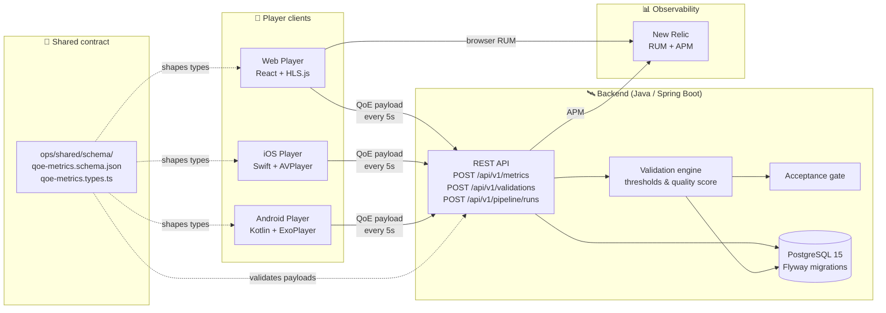
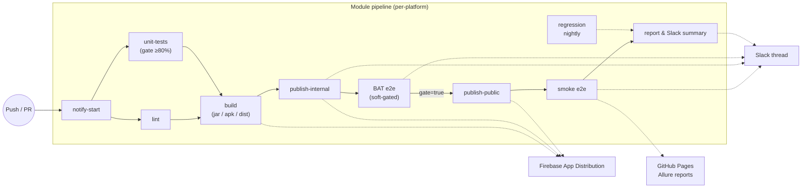

# Cross-Platform Streaming Video QoE Validation in CI/CD Pipelines

A workshop demonstrating end-to-end Quality of Experience (QoE) validation for streaming video across Web, iOS, and Android, with a shared backend, automated multi-stage tests, and full CI/CD pipelines that emit threaded Slack notifications and Allure reports.

## Workshop overview

| | |
|---|---|
| **Duration** | 3–4 hours (half-day workshop) |
| **Audience** | Practitioners working on video streaming, CI/CD, mobile, or QA |
| **Outcome** | Run a full multi-platform QoE pipeline locally, then ship the same pipeline to GitHub Actions with Slack reporting and Firebase distribution |

## Architecture

The four player platforms share a single backend, a single metrics schema, and a single set of CI/CD primitives. Every player collects the same payload shape and posts it to the API every 5 seconds; the API stores it, validates it against thresholds, and exposes a pipeline acceptance gate.



## CI/CD pipeline shape

Each module owns its own GitHub Actions workflow. Pipelines all follow the same gated shape — *test → build → ship a canary → re-validate → promote* — with threaded Slack notifications and Allure reports published to GitHub Pages along the way.



The Web and API pipelines use Firebase Hosting (preview channel → live promotion); the Android and iOS pipelines use Firebase App Distribution (internal canary → public promotion). On a hard BAT failure the public promotion is blocked but the internal release stays live so the team can investigate on the same artifact testers are running.

## Modules

| Module | Description | README |
|---|---|---|
| [`backend-api/`](backend-api/README.md) | Java 21 / Spring Boot 3 REST API + PostgreSQL | Setup, endpoints, test commands |
| [`web-player/`](web-player/README.md) | React + TypeScript + HLS.js player | Setup, E2E tests, Allure reports |
| [`ios-player/`](ios-player/README.md) | Swift Package library + SwiftUI demo app | Library usage, Xcode build, Firebase deploy |
| [`android-player/`](android-player/README.md) | Kotlin / ExoPlayer Android app | Android Studio setup, APK build |
| [`qoe-automation-tests/`](qoe-automation-tests/README.md) | Java / TestNG cross-platform automation | API, web, mobile, validation tests |
| [`ops/`](ops/README.md) | Infrastructure, monitoring, shared schema | nginx, FFmpeg, New Relic, JSON schema |

## Project structure

```
├── backend-api/                 # Spring Boot REST API + Flyway + Testcontainers
├── web-player/                  # React/Vite SPA + Playwright E2E
├── ios-player/                  # SwiftPM library (QoePlayer) + SwiftUI demo app
├── android-player/              # Gradle (Kotlin DSL) Android app + Espresso
├── qoe-automation-tests/        # Maven/TestNG cross-platform suite
├── ops/
│   ├── infrastructure/          # nginx config, FFmpeg HLS transcoder, tc network sim
│   ├── monitoring/              # New Relic dashboards, alerts, NRQL
│   └── shared/schema/           # Canonical qoe-metrics.schema.json + TS types
├── test-videos/                 # Sample HLS streams (gitignored placeholder)
├── docker-compose.yml           # Full local stack (api + web + db + nginx)
└── .github/
    ├── workflows/               # Per-module pipelines + shared/utility workflows
    ├── scripts/                 # Slack payload builders + Allure helpers
    └── actions/                 # Reusable composite actions
```

## Quick start

### Prerequisites

| Tool | Min version | Used by |
|---|---|---|
| Docker Desktop | 24+ | full stack |
| Java JDK | **21+** | `backend-api` and `qoe-automation-tests` |
| Node.js | 18+ | `web-player` |
| Maven | 3.9+ | `qoe-automation-tests` |
| Allure CLI | 2.27+ | viewing test reports — `brew install allure` |
| Xcode | 15+ | `ios-player` (macOS only) |
| Android Studio | Hedgehog or later | `android-player` |

### Bring up the full stack

```bash
docker compose up -d
docker compose ps
curl http://localhost:8080/actuator/health
```

| Service | URL |
|---|---|
| Backend API | http://localhost:8080 |
| API docs (Swagger UI) | http://localhost:8080/swagger-ui/index.html |
| Web Player | http://localhost:3000 |
| nginx (video CDN) | http://localhost:8081 |
| PostgreSQL | localhost:5432 |

### Run the test suites

```bash
# API — unit only (no Docker), full E2E, or both
cd backend-api && ./gradlew unitTest
cd backend-api && ./gradlew e2eTest      # Testcontainers spins up its own Postgres
cd backend-api && ./gradlew test         # both

# Web — Vitest unit + Playwright E2E against the running stack
cd web-player && npm test
cd web-player && npm run e2e:docker

# Cross-platform automation suite
cd qoe-automation-tests && mvn test -Dapi.base.url=http://localhost:8080
```

A more detailed walk-through (BAT/Smoke/Regression stages, mobile, Allure local serving) lives in [`TESTING.md`](TESTING.md).

## CI/CD workflows

All workflows live in [`.github/workflows/`](.github/workflows/).

| Workflow | Trigger | Module |
|---|---|---|
| `qoe-api-tests.yml` | push / PR on `backend-api/**` | Backend API |
| `qoe-web-tests.yml` | push / PR on `web-player/**` | Web Player |
| `qoe-android-tests.yml` | push / PR on `android-player/**` | Android Player |
| `qoe-ios-tests.yml` | push / PR on `ios-player/**` | iOS Player |
| `qoe-validation.yml` | pull request | Lightweight matrix across modules |
| `qoe-pr-e2e.yml` | pull request | Web + API (Docker stack + Playwright gate) |
| `qoe-newrelic.yml` | push / PR on monitoring config | New Relic dashboards / alerts |
| `build-acceptance-release.yml` | manual | All modules — acceptance + release |
| `shared-notify-start.yml` | `workflow_call` | Reusable "build started" Slack notify |

Reusable composite actions: `slack-stage-notify`, `slack-gate-notify`, `slack-pipeline-report`, `publish-allure`, `lambdatest-espresso`.

## Workshop sessions

1. **Foundation & Architecture** (45 min) — QoE metrics, why per-platform collection matters, schema design.
2. **Hands-on Project Setup** (60 min) — bring up the stack, run tests locally, view reports.
3. **CI/CD Integration** (60 min) — module pipelines, gates, threaded Slack output, Firebase distribution.
4. **Advanced Scenarios & Best Practices** (45 min) — soft gates, device-lab outages, rollback, observability.

## License

Educational use as part of the DevOpsDays Raleigh 2026 workshop.
