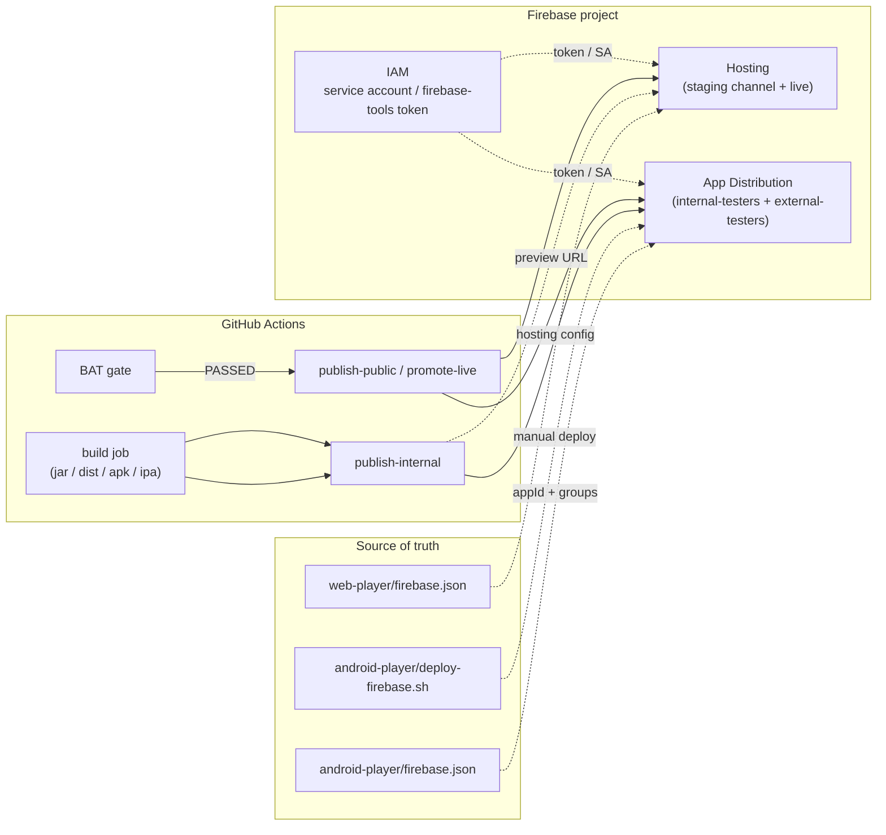

# Firebase Setup & Integration

End-to-end guide to wiring Firebase into the QoE pipelines:

- **Firebase Hosting** — preview channel + live promotion for `web-player` and (optionally) `backend-api` Swagger.
- **Firebase App Distribution** — internal (canary) and public (external testers) drops for `android-player` and `ios-player`.



## What it gives you

| Module | Channel | Where in CI | URL or destination |
|---|---|---|---|
| `web-player` | Hosting `staging` channel | `deploy-preview` job in `stream-qoe-app-web.yml` | `https://<project>--<channel>-<hash>.web.app` (fixed per `FIREBASE_PREVIEW_URL`) |
| `web-player` | Hosting `live` channel | `promote-live` job (after BAT gate) | `https://<project>.web.app` |
| `android-player` | App Distribution `internal-testers` | `publish-internal` job in `stream-qoe-app-android.yml` | Tester invitation email + Firebase console |
| `android-player` | App Distribution `external-testers` | `publish-public` job (after Unit + BAT gates) | Tester invitation email + Firebase console |
| `ios-player` | App Distribution (internal/public) | `firebase-publish` and `firebase-publish-pub` steps in `stream-qoe-app-ios.yml` | IPA distributed to testers |

The pipeline is **soft-gated**: every Firebase step is wrapped in `if: env.FIREBASE_TOKEN != '' && env.FIREBASE_APP_ID_* != ''` so a workshop attendee without Firebase credentials still gets a green build (the publish step reports `skipped` in Slack).

---

## 1. Create the Firebase project

1. <https://console.firebase.google.com> → **Add project** (or pick an existing one).
2. Name: anything; Google Analytics is **not required** for this workshop.
3. After creation, note the **Project ID** (e.g. `devopsdays-119f5`) — visible in **Project settings → General**. This is `FIREBASE_PROJECT_ID`. **Project ID is not secret** (it shows up in every public Firebase URL), so prefer storing it as a repo **variable**.

## 2. Decide which products you need

| Product | Why | Setup |
|---|---|---|
| **Hosting** | Web preview + live | Console → **Hosting → Get started** → run the wizard once for the project |
| **App Distribution** | Mobile internal + public canary | Console → **App Distribution → Get started**; create groups `internal-testers` and `external-testers` (or your own names) |

Add an Android app and/or an iOS app under **Project settings → Your apps**:

- For Android, copy the `google-services.json` it generates into `android-player/app/` (already committed). Note the **App ID** at the top — looks like `1:710273242702:android:23bc7b2f44d278c4ff151f`. This is `FIREBASE_APP_ID_ANDROID`.
- For iOS, register the bundle ID and copy `GoogleService-Info.plist` into the iOS player; the App ID has the form `1:710273242702:ios:…`. This is `FIREBASE_APP_ID_IOS`.

> **App IDs are sensitive enough to keep in secrets** in this workshop because they end up next to OAuth client IDs in the same JSON files.

## 3. Get a CI credential

Two equally valid paths — pick one. The pipelines work with either.

### Option A — Firebase CI token (simplest, what the workshop ships with)

```bash
npm install -g firebase-tools
firebase login:ci
# → opens browser → authorize → prints a token starting with "1//"
```

That token goes into the repo as `FIREBASE_TOKEN`. It's tied to the user that authorized — **rotate it whenever that user leaves**.

> The `firebase-tools` CLI prints a deprecation warning for `login:ci` on newer versions but the workflows continue to support it. If your CI runs fail because the token was revoked, you can re-authorize without changing any workflow YAML.

### Option B — Service account JSON (recommended for orgs)

1. Console → **Project settings → Service accounts → Generate new private key**.
2. Save the JSON, base64-encode it (`base64 -i sa.json | pbcopy` on macOS), store as `FIREBASE_SERVICE_ACCOUNT_JSON` (or use [`google-github-actions/auth`](https://github.com/google-github-actions/auth)).
3. Replace `--token "$FIREBASE_TOKEN"` calls with `firebase --project $FIREBASE_PROJECT_ID …` after `gcloud auth activate-service-account`.

## 4. Configure repo secrets & variables

Settings → Secrets and variables → Actions:

### Secrets

| Secret | Required for | Notes |
|---|---|---|
| `FIREBASE_TOKEN` | every Firebase publish | `1//…` from `firebase login:ci` |
| `FIREBASE_APP_ID_ANDROID` | Android publish-internal / public | `1:…:android:…` |
| `FIREBASE_APP_ID_IOS` | iOS publish-internal / public | `1:…:ios:…` |
| `FIREBASE_PROJECT_ID` *(optional)* | fallback if no repo variable | non-secret; prefer the variable |
| `FIREBASE_PREVIEW_URL` *(optional)* | web preview deploy fallback | non-secret; prefer the variable |
| `FIREBASE_INTERNAL_TESTERS` *(optional)* | Android internal — tester emails | comma-separated emails (overrides groups) |
| `FIREBASE_PUBLIC_TESTERS` *(optional)* | Android public — tester emails | comma-separated emails |
| `FIREBASE_TESTERS` *(legacy)* | Android public — group fallback | older name; only used if `FIREBASE_PUBLIC_*` are unset |

### Variables

| Variable | Required for | Default |
|---|---|---|
| `FIREBASE_PROJECT_ID` | every job | none — the workflow fails if neither var nor secret is set |
| `FIREBASE_PREVIEW_URL` | web `deploy-preview` | first-time setup populates this — see **First-time web preview** below |
| `FIREBASE_CHANNEL_ID` | web `deploy-preview` | `staging` |
| `FIREBASE_INTERNAL_GROUPS` | Android internal | `internal-testers` |
| `FIREBASE_PUBLIC_GROUPS` | Android public | `external-testers` |

> **Why URLs and project IDs are variables, not secrets:** GitHub Actions automatically masks every secret value in workflow logs as `***`. If `FIREBASE_PROJECT_ID` is a secret, the URL it builds (`https://devopsdays-119f5.web.app`) gets censored to `https://***.web.app` in Slack notifications and in the run UI. Variables are stored in plaintext in logs by design — perfect for non-secret IDs.

---

## 5. Web Player — Hosting (preview + live)

The web pipeline uses Firebase's **fixed-channel** strategy:

1. The first deploy ever to channel `staging` creates a stable URL (`https://<project>--staging-<hash>.web.app`).
2. Every subsequent deploy redeploys the **same** channel, so the URL stays static.
3. After BAT passes, `firebase hosting:clone staging:live` promotes the channel content to the production domain `https://<project>.web.app`.

### Hosting config

[`web-player/firebase.json`](../web-player/firebase.json):

```json
{
  "hosting": {
    "public": "dist",
    "rewrites": [{ "source": "**", "destination": "/index.html" }],
    "headers": [
      { "source": "**/*.@(js|css)", "headers": [{ "key": "Cache-Control", "value": "max-age=31536000" }] },
      { "source": "**", "headers": [
          { "key": "X-Frame-Options", "value": "SAMEORIGIN" },
          { "key": "X-Content-Type-Options", "value": "nosniff" }
      ]}
    ]
  }
}
```

### First-time preview channel setup

The first deploy is manual (the URL doesn't exist yet to be discovered):

```bash
cd web-player
npm install && npm run build
firebase login                                      # OR: firebase use $FIREBASE_PROJECT_ID
firebase hosting:channel:deploy staging \
  --expires 30d \
  --project $FIREBASE_PROJECT_ID
# Channel URL (staging): https://devopsdays-119f5--staging-abc123.web.app
```

Copy that URL and paste it into the repo:

```
Settings → Secrets and variables → Actions → Variables → New
  Name:  FIREBASE_PREVIEW_URL
  Value: https://devopsdays-119f5--staging-abc123.web.app
```

From that point on `stream-qoe-app-web.yml`'s `deploy-preview` job redeploys to `staging` on every push without needing to scrape the URL from CLI output (the original failure mode this strategy was designed to avoid).

### Promotion to live

The `promote-live` job runs after BAT passes:

```bash
firebase hosting:clone $FIREBASE_PROJECT_ID:staging $FIREBASE_PROJECT_ID:live \
  --project $FIREBASE_PROJECT_ID \
  --token $FIREBASE_TOKEN
```

Live URL is hard-coded as `https://$FIREBASE_PROJECT_ID.web.app` since Firebase's default domain is deterministic.

> The `staging` channel is **not** deleted after promotion — it has to remain so the next preview deploy reuses the same URL. If you ever want to wipe it, run `firebase hosting:channel:delete staging --project $FIREBASE_PROJECT_ID`.

---

## 6. Android Player — App Distribution

Two pipeline jobs publish the same APK twice with different release notes and tester groups:

| Stage | Tester audience | Trigger |
|---|---|---|
| `publish-internal` | `internal-testers` (or `FIREBASE_INTERNAL_TESTERS` emails) | Always after `build` succeeds — soft-gated by Unit only |
| `publish-public` | `external-testers` (or `FIREBASE_PUBLIC_TESTERS` emails) | Strictly gated — needs both Unit *and* BAT to pass |

Both use [`wzieba/Firebase-Distribution-Github-Action@v1`](https://github.com/wzieba/Firebase-Distribution-Github-Action), which wraps `firebase appdistribution:distribute`.

### Tester resolution algorithm

The workflow picks **exactly one** of `groups` or `testers` (passing both makes the underlying CLI 404 if any group is missing). Order of preference:

1. `vars.FIREBASE_<INTERNAL|PUBLIC>_TESTERS` — comma-separated emails
2. `secrets.FIREBASE_<INTERNAL|PUBLIC>_TESTERS` — same shape, secret-stored
3. `vars.FIREBASE_<INTERNAL|PUBLIC>_GROUPS` — group names
4. (public only) `secrets.FIREBASE_TESTERS` — legacy single-list fallback
5. Default group — `internal-testers` or `external-testers`

### Manual deploy from your laptop

For workshop demos there's a hand-roll script: [`android-player/deploy-firebase.sh`](../android-player/deploy-firebase.sh):

```bash
cd android-player
firebase login                                      # one-time
FIREBASE_APP_ID="1:710273242702:android:23bc7b2f44d278c4ff151f" \
  ./deploy-firebase.sh
```

It runs `gradle assembleDebug` and uploads `app/build/outputs/apk/debug/app-debug.apk` to the project's `testers` group.

### `firebase.json` for App Distribution

[`android-player/firebase.json`](../android-player/firebase.json) is read by the local `firebase appdistribution:distribute` CLI when you don't pass flags:

```json
{
  "appdistribution": {
    "appId": "YOUR_FIREBASE_ANDROID_APP_ID",
    "releaseNotes": "Debug build from local workspace",
    "groups": ["testers"]
  }
}
```

> The CI pipeline doesn't read this file — it passes everything via the action's inputs. The file exists for the local `deploy-firebase.sh` flow.

---

## 7. iOS Player — App Distribution

Mirrors Android with the iOS-specific binary path (the SwiftPM build outputs at `ios-player/.build/release/QoePlayer`):

```yaml
- id: firebase-publish
  if: env.FIREBASE_TOKEN != '' && env.FIREBASE_APP_ID_IOS != ''
  run: |
    firebase appdistribution:distribute ios-player/.build/release/QoePlayer \
      --app "$FIREBASE_APP_ID_IOS" \
      --token "$FIREBASE_TOKEN" \
      --groups "${FIREBASE_TESTERS:-external-testers}" \
      --release-notes "Public release — Build #$RUN_NUMBER"
```

The iOS workflow uses a single `FIREBASE_TESTERS` group rather than the Android `INTERNAL` / `PUBLIC` split because the workshop demo uses a TestFlight-style "all testers see every drop" model.

---

## 8. Verification checklist

After secrets are in place, do this end-to-end check:

| Module | Push that triggers it | Expect to see |
|---|---|---|
| `web-player` | Push touching `web-player/**` on a feature branch | `deploy-preview` job green; Slack thread shows "Firebase Preview Deploy — PASSED" with a clickable preview URL; the URL serves the new build within ~30 seconds |
| `web-player` | Push merged to `main` (or BAT passes on the branch) | `promote-live` job green; live URL `https://<project>.web.app` updates |
| `android-player` | Push touching `android-player/**` | `publish-internal` job green; tester invitation email arrives at the address listed in `FIREBASE_INTERNAL_TESTERS` |
| `android-player` | Same push, after BAT gate | `publish-public` job green; second tester invitation email |
| `ios-player` | Push touching `ios-player/**` | Same shape as Android; check the iOS Firebase console |

If a publish job is **skipped**, that's the soft-gate kicking in — it means either `FIREBASE_TOKEN` or the relevant `FIREBASE_APP_ID_*` is empty.

---

## 9. Troubleshooting

| Symptom | Likely cause | Fix |
|---|---|---|
| `Error: HTTP Error: 401, Unauthorized` | `FIREBASE_TOKEN` revoked or expired | Re-run `firebase login:ci`, update the secret |
| `Error: HTTP Error: 404, App distribution group not found` | Both `groups` *and* `testers` were passed (action quirk) | Set only one; the workflow's `Resolve targets` step should handle this — confirm the env vars |
| Slack `Firebase Preview Deploy` step shows `***` instead of a URL | `FIREBASE_PROJECT_ID` is a **secret** (gets masked) | Move it to a repo **variable** of the same name |
| `firebase: command not found` in CI | `npm install -g firebase-tools` step missing or cached without it | Re-run with cache disabled, or pin `firebase-tools` in the install step |
| Preview channel URL changed unexpectedly | Channel was deleted manually | Re-run the manual `firebase hosting:channel:deploy staging` flow above and update `FIREBASE_PREVIEW_URL` |
| BAT failed but public channel got promoted anyway | Pipeline misconfigured | The promotion job's `if:` requires `needs.bat-e2e.outputs.gate_passed == 'true'` — confirm it's not been weakened to `!= 'false'` (which lets `skipped` through) |
| Quota exceeded on App Distribution | Hit the 150 testers / app limit on the free tier | Roll testers into a group instead of listing emails individually |

Useful upstream docs:

- [`firebase-tools` reference](https://github.com/firebase/firebase-tools)
- [`firebase hosting:channel:deploy`](https://firebase.google.com/docs/hosting/test-preview-deploy)
- [`firebase appdistribution:distribute`](https://firebase.google.com/docs/app-distribution/android/distribute-cli)
- [`wzieba/Firebase-Distribution-Github-Action`](https://github.com/wzieba/Firebase-Distribution-Github-Action) — the action used by the Android workflow
- [Firebase service account auth](https://firebase.google.com/support/guides/service-accounts) — for Option B above
