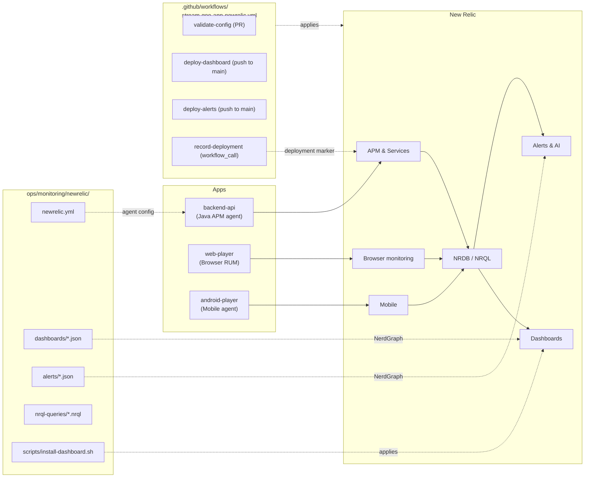

# New Relic Setup & Integration

End-to-end guide to wiring New Relic into the QoE stack: Java APM on the backend, Browser RUM on the web player, Mobile APM on Android, plus dashboards and alerts deployed as code from `ops/monitoring/newrelic/`.



## What it gives you

| Layer | Source of data | Surfaces in NR as |
|---|---|---|
| Java APM | `newrelic.jar` agent attached to `backend-api` (`NEWRELIC_ENABLED=true`) | APM & Services → `QoE API (Workshop)` — transactions, DB queries, distributed traces |
| Browser RUM | `@newrelic/browser-agent` initialised in `web-player/src/services/newrelic.ts` | Browser → page views, AJAX, JavaScript errors |
| Mobile APM | `com.newrelic.agent.android:android-agent` attached at Gradle build time | Mobile → Android crashes, HTTP timing, custom events |
| Custom QoE event | `QoEMetric` posted from every player + recorded in APM via `NewRelic.recordCustomEvent` on the API | NRDB — drives the cross-platform dashboard |
| Dashboards | `ops/monitoring/newrelic/dashboards/qoe-dashboard.json` | NR UI → Dashboards → "QoE Workshop — Cross-Platform Quality of Experience" |
| Alerts | `ops/monitoring/newrelic/alerts/*.json` (high buffering, quality degradation) | NR UI → Alerts & AI → conditions |
| Deployment marker | `newrelic/deployment-marker-action@v2.5.0` (called from release workflow) | APM → entity → Deployments tab; overlays on every chart |

---

## 1. Get the keys you need

New Relic has several distinct token types. Grab them in this order:

| Token | Looks like | Where to get it | Used by |
|---|---|---|---|
| **Account ID** | `7996933` (numeric) | Top-right user menu → **Administration** → **Account settings** | `NEW_RELIC_ACCOUNT_ID`, dashboard JSON, all NRQL widgets |
| **Ingest license key** | 40-char `eu01xx…NRAL` | One UI → **Administration → API keys** → filter by **Ingest – License** | `NEWRELIC_LICENSE_KEY` (Java agent), `VITE_NEWRELIC_LICENSE_KEY` (Browser if same) |
| **User API key** | `NRAK-…` | Same page → **Create key** → **User** | `NEW_RELIC_USER_API_KEY` (used by NerdGraph to apply dashboards/alerts) |
| **Browser license sub-key** | `NRJS-…` | One UI → **Add data → Browser monitoring → Copy/paste JS code** → look inside `NREUM.info` | `VITE_NEWRELIC_LICENSE_KEY` |
| **Browser application ID** | numeric | Same JS snippet → `NREUM.info.applicationID` | `VITE_NEWRELIC_APPLICATION_ID` |
| **Android mobile token** | `AA…` | One UI → **Add data → Mobile → Android** → app token | `NEW_RELIC_MOBILE_TOKEN` (Gradle property) |
| **APM entity GUID** | `MTcwM…` (base64-ish) | APM → entity page → **Copy entity GUID** | `NEW_RELIC_APM_GUID` (deployment marker only — optional) |

> **Region matters.** EU accounts use a different NerdGraph endpoint and a different beacon host. Set `NR_REGION=eu` (or `NEW_RELIC_REGION` secret) when you're not on US.

---

## 2. Backend — Java APM agent

The agent is **opt-in** and gated on two env vars (see [`backend-api/docker-entrypoint.sh`](../backend-api/docker-entrypoint.sh)):

```bash
NEWRELIC_ENABLED=true
NEWRELIC_LICENSE_KEY=<40-char-license-key>
```

Both must be set for the entrypoint to add `-javaagent:/opt/newrelic/newrelic.jar` to the JVM. With them set:

```bash
docker compose up -d backend
docker compose logs backend | grep -i newrelic
# [entrypoint] New Relic APM enabled: app=QoE API (Workshop)
```

The agent config lives at [`ops/monitoring/newrelic/newrelic.yml`](../ops/monitoring/newrelic/newrelic.yml):

```yaml
common: &default_settings
  app_name: QoE API
  license_key: ${NEWRELIC_LICENSE_KEY}
  distributed_tracing:
    enabled: true        # stitches frontend → API spans into one trace
  application_logging:
    enabled: true
    forwarding:
      enabled: true      # pipes Logback log lines into NR Logs UI
      max_samples_stored: 10000
```

Custom QoE events are recorded by `QoEMetricsService` via the `com.newrelic.agent:newrelic-api` library:

```java
// see backend-api/src/main/java/com/devopsdays/qoe/api/services/QoEMetricsService.java
NewRelic.recordCustomEvent("QoEMetric", attributes);
```

These show up as `QoEMetric` rows in NRDB and feed every "backend" widget on the dashboard.

### Verify

```bash
curl -s http://localhost:8080/actuator/health
curl -s -X POST http://localhost:8080/api/v1/metrics -d @sample-payload.json -H 'Content-Type: application/json'
# Then in NR: APM → QoE API (Workshop) → wait ~60s for the first datapoint
```

---

## 3. Web — Browser RUM

The web player auto-initialises the agent if (and only if) **all three** Vite env vars are set at build time. Vite inlines them into the bundle, so re-build after changing them.

```bash
# .env (copy from .env.example)
VITE_NEWRELIC_LICENSE_KEY=NRJS-xxxxxxxxxxxx
VITE_NEWRELIC_APPLICATION_ID=1234567890
VITE_NEWRELIC_ACCOUNT_ID=7996933
# Optional:
VITE_NEWRELIC_TRUST_KEY=7996933        # defaults to ACCOUNT_ID
VITE_NEWRELIC_AGENT_ID=1234567890      # defaults to APPLICATION_ID
```

Implementation: [`web-player/src/services/newrelic.ts`](../web-player/src/services/newrelic.ts) — uses `@newrelic/browser-agent` from npm rather than the copy-paste `<script>` snippet so the agent is lockfile-pinned and TypeScript-typed. Also wires `recordPageAction()` so the QoE collector can emit `QoEMetric` PageAction events alongside backend custom events.

### Verify

```bash
docker compose up -d web-player
open http://localhost:3000
# Open DevTools → Network tab → look for "bam.nr-data.net" requests
# Then in NR: Browser → your app → wait ~60s for "Ajax" + "Page actions"
```

If you see `[newrelic] Browser RUM disabled` in the console, one of the three env vars is missing — Vite stripped the agent at build time. Rebuild after fixing the `.env`.

---

## 4. Android — Mobile APM

The agent is opt-in via a Gradle property (`-Pnewrelic.token=…`) or env var (`NEW_RELIC_MOBILE_TOKEN`), checked in [`android-player/app/build.gradle.kts`](../android-player/app/build.gradle.kts):

```kotlin
val nrToken: String = (project.findProperty("newrelic.token") as? String)
    ?: System.getenv("NEW_RELIC_MOBILE_TOKEN")
    ?: ""
// agent applied via: apply(plugin = "newrelic")
// runtime dep: implementation("com.newrelic.agent.android:android-agent:7.5.1")
```

Build with the token:

```bash
cd android-player
./gradlew :app:assembleDebug -Pnewrelic.token=$NEW_RELIC_MOBILE_TOKEN
```

In CI we pass it via the workflow env. With no token the agent stays uninstalled and the APK is identical to a non-instrumented build.

> iOS does not have a New Relic agent in this workshop. Only Web RUM (via the Browser agent) and the backend Java APM cover Apple device traffic.

---

## 5. Dashboards & alerts as code

Everything in [`ops/monitoring/newrelic/`](../ops/monitoring/newrelic/) is the **source of truth** — the version in your NR account is recreated from these files.

```
ops/monitoring/newrelic/
├── newrelic.yml                # Java agent config baked into backend Dockerfile
├── dashboards/
│   └── qoe-dashboard.json      # 1 cross-platform dashboard (Overview / Web / Backend tabs)
├── alerts/
│   ├── high-buffering.json     # warn when avg(totalBufferingTime) > 10 for 5m
│   └── quality-degradation.json# crit when poor-quality ratio > 0.5 for 5m
├── nrql-queries/
│   └── qoe-metrics.nrql        # ready-to-paste query reference
└── scripts/
    └── install-dashboard.sh    # NerdGraph mutation that creates / replaces the dashboard
```

### Apply the dashboard manually

```bash
export NEW_RELIC_USER_API_KEY=NRAK-...
export NEW_RELIC_ACCOUNT_ID=7996933
export NR_REGION=us                    # or 'eu'
ops/monitoring/newrelic/scripts/install-dashboard.sh
# ✓ Created dashboard 'QoE Workshop — Cross-Platform Quality of Experience'
#   GUID: ...
#   Open: https://one.newrelic.com/redirect/entity/<GUID>
```

The script reads the dashboard JSON, rewrites every widget's `accountId` to your account, and POSTs a `dashboardCreate` mutation to NerdGraph. Re-running it creates a **new copy** rather than updating in place — delete the previous one if you want a clean slate.

### Apply alerts manually

```bash
# nr1 CLI (https://one.newrelic.com/launcher/nr1-core.home → "Install nr1")
nr1 nerdgraph:query --file ops/monitoring/newrelic/alerts/high-buffering.json
nr1 nerdgraph:query --file ops/monitoring/newrelic/alerts/quality-degradation.json
```

The CI also wires a `scripts/install-alerts.sh` template — not required to run the workshop.

### Apply via CI (`stream-qoe-app-newrelic.yml`)

The dedicated workflow does three things automatically when monitoring config changes hit `main`:

| Job | Trigger | What it does |
|---|---|---|
| `validate-config` | PR + push | jq-validates dashboard JSON shape, alert JSON syntax, and sanity-checks every NRQL string |
| `deploy-dashboard` | Push to `main` (also `workflow_dispatch`) | Runs `install-dashboard.sh` against NerdGraph |
| `deploy-alerts` | Push to `main` | Runs `install-alerts.sh` if present |
| `record-deployment` | `workflow_call` from the release workflow | Posts a deployment marker to APM via [`newrelic/deployment-marker-action@v2.5.0`](https://github.com/newrelic/deployment-marker-action) |

Required repo secrets:

| Secret | Required for | Notes |
|---|---|---|
| `NEW_RELIC_USER_API_KEY` | dashboard / alerts deploy | `NRAK-…` user key — **not** the ingest license key |
| `NEW_RELIC_ACCOUNT_ID` | dashboard / alerts deploy | numeric, e.g. `7996933` |
| `NEW_RELIC_APM_GUID` | deployment marker | optional; the marker job is skipped silently when absent |
| `NEW_RELIC_REGION` | EU accounts | optional; defaults to `us` |
| `NEW_RELIC_SLACK_DESTINATION_ID` | alert workflow notifications | optional |

Repo variables (preferred for non-secret IDs):

| Variable | Purpose |
|---|---|
| `NEW_RELIC_REGION` | `us` or `eu` |

The `deploy-dashboard` and `deploy-alerts` jobs target a GitHub **environment** named `newrelic` — set that environment up under Settings → Environments if you want a manual reviewer gate before changes hit production.

---

## 6. NRQL queries you'll actually use

[`ops/monitoring/newrelic/nrql-queries/qoe-metrics.nrql`](../ops/monitoring/newrelic/nrql-queries/qoe-metrics.nrql) has the canonical set:

```sql
-- All-up health by platform (matches the dashboard "Overview" tab)
SELECT count(*) AS 'Sessions',
       average(startupTime) AS 'Avg Startup (ms)',
       average(totalBufferingTime) AS 'Avg Buffering (s)',
       sum(errorCount) AS 'Errors'
FROM   QoEMetric
SINCE  1 hour ago
FACET  platform

-- Cross-source query (backend custom event UNION web PageAction)
SELECT count(*) FROM QoEMetric, PageAction
WHERE  actionName = 'QoEMetric' OR eventType() = 'QoEMetric'
SINCE  1 hour ago
```

The trick is that the web player records its events as `PageAction` (`actionName='QoEMetric'`) while the backend records them as a `QoEMetric` custom event. Querying both event sources unifies the two streams in a single dashboard.

---

## 7. Troubleshooting

| Symptom | Likely cause | Fix |
|---|---|---|
| Backend container starts but APM tab stays empty | `NEWRELIC_ENABLED` missing or `NEWRELIC_LICENSE_KEY` blank | Inspect `docker compose logs backend \| grep -i newrelic` — should say "APM enabled" |
| Browser tab empty in NR | Vite env vars missing at *build* time | Re-run `npm run build` (or `docker compose build web-player`) after editing `.env` |
| `dashboardCreate` returns `INVALID_INPUT` from NerdGraph | Account ID in the JSON doesn't match the API key's account | The install script handles this — re-run it; if you used `nr1`, regenerate the JSON |
| `403 Forbidden` from NerdGraph | Used an **ingest** license key instead of a **user** API key | Generate a `NRAK-…` key and update `NEW_RELIC_USER_API_KEY` |
| EU traces missing | Wrong region | `NR_REGION=eu` for scripts; in `.env` set `VITE_NEWRELIC_TRUST_KEY` to your EU account ID |
| Distributed trace breaks at the API boundary | `distributed_tracing.enabled: false` (default for old agents) | Confirmed `true` in `newrelic.yml`; also verify the API responds with `traceparent` headers |

Useful upstream docs:

- [Java agent install](https://docs.newrelic.com/docs/apm/agents/java-agent/installation/install-java-agent/)
- [Browser agent (npm package)](https://github.com/newrelic/newrelic-browser-agent)
- [Android agent install](https://docs.newrelic.com/docs/mobile-monitoring/new-relic-mobile-android/install-configure/install-android-apps-gradle-android-studio/)
- [NerdGraph dashboards API](https://docs.newrelic.com/docs/apis/nerdgraph/examples/nerdgraph-dashboards/)
- [Deployment marker action](https://github.com/newrelic/deployment-marker-action)
