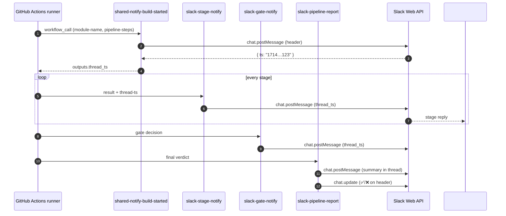

# Slack Bot Setup & Integration

End-to-end guide to wiring a Slack bot into the QoE pipelines so every workflow run posts a threaded build header, per-stage replies, gate decisions, and a final summary that edits the original header to ✅ / ❌.



## What it gives you

| Channel posting | Posted by | Trigger |
|---|---|---|
| Build header (`[MODULE] Build #N` + branch / commit / triggered-by) | `shared-notify-build-started.yml` | First job of every per-module pipeline |
| Per-stage replies (PASSED / FAILED / SKIPPED + duration + report URL + pass-rate) | `.github/actions/slack-stage-notify` | Every test, build, publish stage |
| One-line gate decisions (proceeding / blocking) | `.github/actions/slack-gate-notify` | Unit gate, BAT gate |
| Final pipeline summary + ✅/❌ edit on the header | `.github/actions/slack-pipeline-report` | Last job (`report`) of every pipeline |
| PR-E2E result | `stream-qoe-app-pr-e2e.yml` | PRs touching web/api |
| Release-acceptance summary | `stream-qoe-app-release.yml` | Manual release dispatch |

All Slack code paths gate on `secrets.SLACK_BOT_TOKEN != '' && secrets.SLACK_CHANNEL_ID != ''`, so forks and PRs without secrets fail silently rather than red-X'ing the build.

---

## 1. Create the Slack app

1. Go to <https://api.slack.com/apps> → **Create New App** → **From scratch**.
2. App name: `QoE Workshop Bot` (anything is fine), workspace: your workshop workspace.
3. **OAuth & Permissions** → **Bot Token Scopes** — add the scopes the pipeline needs:

   | Scope | Why |
   |---|---|
   | `chat:write` | Post the build header + threaded replies |
   | `chat:write.customize` | Post with a custom username/icon (optional but used by some workflows) |
   | `chat:write.public` | Post into a public channel without inviting the bot first (skip if you'll invite it) |
   | `channels:read` *(optional)* | Lets `cleanup-stale-workflows.sh` resolve channel name → ID |

4. **Install to Workspace** at the top of the OAuth page → authorize.
5. Copy the **Bot User OAuth Token** — it starts with `xoxb-…`. This is `SLACK_BOT_TOKEN`.

## 2. Pick the channel and grab its ID

1. Create or pick a channel — `#qoe-builds` is the convention.
2. **Right-click the channel → Copy link**, paste it somewhere; the URL ends in `/archives/C012AB3CD` — that final segment is the **channel ID** (`C…` for public channels, `G…`/`D…` for private/DM).
3. If you didn't grant `chat:write.public`, invite the bot: in the channel run `/invite @QoE Workshop Bot`.

## 3. Add the secrets to the repo

GitHub → **Settings → Secrets and variables → Actions → New repository secret**:

| Secret | Value |
|---|---|
| `SLACK_BOT_TOKEN` | `xoxb-…` from step 1.5 |
| `SLACK_CHANNEL_ID` | `C012AB3CD` from step 2.2 |

> Both are **secrets** (not variables) — Slack tokens leak read access to your channel history.

## 4. Verify the wiring

Push any commit on a branch that touches `backend-api/`, `web-player/`, `android-player/`, or `ios-player/`. You should see, within ~10 seconds:

1. A new top-level message in `#qoe-builds`: `[API] Stream-QoE-App | Build #N` with the branch, commit link, and a primary-coloured **View Run** button.
2. Replies threaded under it as each stage finishes (`Unit Tests — PASSED in 1m 23s`, …).
3. After the `report` job, the original message header flips to `✅ [API] Stream-QoE-App | Build #N — Passed (12m 45s)` (or `❌` if any stage failed).

If nothing posts, the four most common causes are:

| Symptom | Cause | Fix |
|---|---|---|
| `notify-start` job is green but no Slack message | Secrets not set | Re-check `SLACK_BOT_TOKEN` / `SLACK_CHANNEL_ID` exist on the repo (not the org) |
| `not_in_channel` in the run logs | Bot not invited to a private channel | `/invite @bot` in the channel, or grant `chat:write.public` |
| `invalid_auth` | Token typo or token rotated | Reinstall the app in Slack and copy the new `xoxb-…` |
| Stage replies missing but header posted | `thread-ts` not threaded through | Confirm every job declares `needs: [notify-start]` and uses `${{ needs.notify-start.outputs.thread_ts }}` |

---

## 5. How the pieces fit together

### `shared-notify-build-started.yml`

Reusable workflow — every per-module pipeline calls this first. It posts the header and exports `thread_ts` + `start_epoch` as workflow outputs.

```yaml
notify-start:
  uses: ./.github/workflows/shared-notify-build-started.yml
  with:
    module-name: API
    pipeline-steps: "Unit tests → BAT → Smoke"
    environment-label: STAGE
  secrets:
    SLACK_BOT_TOKEN:  ${{ secrets.SLACK_BOT_TOKEN }}
    SLACK_CHANNEL_ID: ${{ secrets.SLACK_CHANNEL_ID }}
```

Downstream jobs read the thread:

```yaml
unit-tests:
  needs: [notify-start]
  steps:
    - uses: ./.github/actions/slack-stage-notify
      with:
        thread-ts: ${{ needs.notify-start.outputs.thread_ts }}
        # …
```

### Composite actions

All five actions live in [`.github/actions/`](../.github/actions/README.md). The Slack-specific ones are:

| Action | What it sends | Built from |
|---|---|---|
| [`slack-stage-notify`](../.github/actions/slack-stage-notify) | Per-stage reply with PASSED/FAILED/SKIPPED, duration, pass-rate, report link | [`stage_result_to_slack.py`](../.github/scripts/stage_result_to_slack.py) → Block Kit JSON → `slackapi/slack-github-action@v2.1.1` |
| [`slack-gate-notify`](../.github/actions/slack-gate-notify) | One-liner "gate PASSED — proceeding" or "gate FAILED — blocking" | Inline payload |
| [`slack-pipeline-report`](../.github/actions/slack-pipeline-report) | Final summary reply + edits the original header to ✅/❌ | [`module_result_to_slack.py`](../.github/scripts/module_result_to_slack.py) (summary) + [`update_build_message.py`](../.github/scripts/update_build_message.py) (header edit) |

### Block Kit payload structure

The header message is built in `shared-notify-build-started.yml` and looks like:

```json
{
  "blocks": [
    { "type": "header",  "text": { "type": "plain_text", "text": "[API] Stream-QoE-App  |  Build #142" } },
    { "type": "section", "text": { "type": "mrkdwn", "text": "*Branch:* `feature/x`  |  *Commit:* <…|abc1234>  |  *Triggered by:* @user" } },
    { "type": "divider" },
    { "type": "context", "elements": [{ "type": "mrkdwn", "text": "⏳ Unit tests → BAT → Smoke. Results will follow in this thread." }] },
    { "type": "actions", "elements": [{ "type": "button", "text": { "type": "plain_text", "text": "View Run" }, "url": "…", "style": "primary" }] }
  ]
}
```

When the pipeline finishes, `update_build_message.py` calls `chat.update` on the same `ts` so the header gains the final verdict and the total pipeline duration — no scrolling required.

---

## 6. Local debugging

Test the payload generator without GitHub:

```bash
# Render the per-stage Block Kit JSON locally
MODULE_NAME=WEB \
STAGE_NAME="Unit Tests" \
STAGE_RESULT=success \
JUNIT_DIR=web-player/test-results \
REPORT_URL=https://example.com/allure/web/unit \
python3 .github/scripts/stage_result_to_slack.py

cat stage-slack-payload.json | jq .
```

Send the rendered payload to Slack:

```bash
curl -fsSL -X POST https://slack.com/api/chat.postMessage \
  -H "Authorization: Bearer $SLACK_BOT_TOKEN" \
  -H "Content-Type: application/json; charset=utf-8" \
  --data-binary @stage-slack-payload.json
```

The Slack API returns `{"ok": true, "ts": "…"}` on success. Errors come back as `{"ok": false, "error": "channel_not_found" | "not_in_channel" | "invalid_auth" | …}`.

Useful Slack docs while debugging:

- [Block Kit Builder](https://app.slack.com/block-kit-builder) — paste your JSON and preview it
- [`chat.postMessage`](https://api.slack.com/methods/chat.postMessage) reference
- [`chat.update`](https://api.slack.com/methods/chat.update) reference (used to flip the header to ✅/❌)
- [Bot token scopes catalogue](https://api.slack.com/scopes)

---

## 7. Cleanup / rotation

- **Rotate the token**: Slack admin → app → **OAuth & Permissions** → **Reinstall to Workspace** → copy the new `xoxb-…` → update `SLACK_BOT_TOKEN` secret.
- **Revoke**: same page → **Revoke Tokens** — every running pipeline will start failing closed (silently — see the gate behaviour above).
- **Audit**: Slack → workspace settings → **Apps & Integrations** → click the bot → **App activity log** shows every API call.
- **Stale messages**: `.github/scripts/cleanup-stale-workflows.sh` archives or deletes outdated workflow runs and their associated Slack threads.
