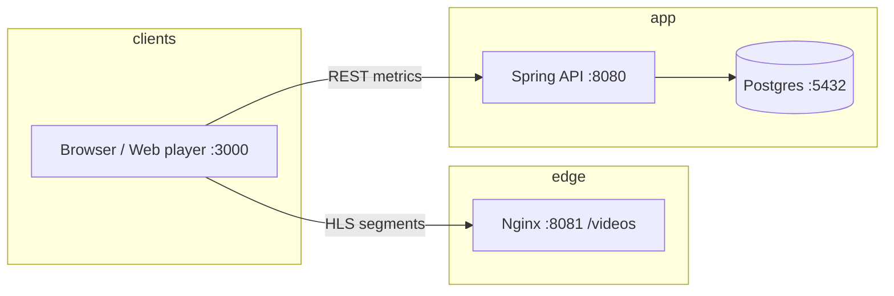

# DevOpsDays QoE Workshop — 90-minute facilitator guide

Audience: engineers and QA interested in streaming QoE, API-backed metrics, Docker, and automated validation.  
Repo root for commands: `DevOpsDays/` (contains `docker-compose.yml`).

---

## Learning outcomes

By the end, participants can:

- Explain how the **web player**, **Spring API**, **Postgres**, and **Nginx (test CDN)** fit together.
- **Ingest and query** QoE metrics via the REST API.
- Run the **TestNG / Maven** automation suite (or a subset) against a local stack.
- Describe how the **validation engine** turns raw metrics into pass/fail and a quality score.

---

## Pre-workshop checklist (facilitator)

- [ ] Docker Desktop running; `docker compose version` works.
- [ ] From ``: `docker compose up -d --build` succeeds (first run may take several minutes).
- [ ] Java 17+ and Maven 3.8+ on the machine used for demos (`java -version`, `mvn -version`).
- [ ] For **web tests** (`WebPlayerQoETest`): ChromeDriver compatible with local Chrome, or demo **API-only** paths.
- [ ] **Mobile tests** require Appium and a device/emulator; plan to **skip live** or show `MobileQoETest` as “pipeline-only” unless you have a lab setup.
- [ ] Terminal font size readable when projected; browser zoom ~100%.

Optional: export `NEWRELIC_ENABLED=true` and a license key in `.env` if you want to demo APM (compose already wires env vars).

---

## Timeboxed agenda (90 minutes)

| Minutes | Duration | Block | What you do |
|--------:|---------:|-------|----------------|
| 0–10 | 10 | **Welcome & QoE framing** | Intros; define QoE vs QoS; startup time, rebuffering, errors, bitrate ladders; why APIs and tests matter for releases. |
| 10–25 | 15 | **Architecture** | Walk the diagram below; trace a playback session → metrics POST → DB → GET/summary; mention `/videos/` on Nginx (8081) vs player (3000) vs API (8080). |
| 25–40 | 15 | **Docker deep dive (live)** | `docker compose ps`; healthchecks (Postgres → backend); `docker compose logs -f backend` (short); show `http://localhost:8081/` and `/videos/`. |
| 40–55 | 15 | **API lab (live)** | Run `presentations/demos/demo-api.sh` **or** paste curls from `DEMO-COMMANDS.md`; show DB indirectly via API list/summary. |
| 55–70 | 15 | **Test automation** | `cd qoe-automation-tests`; `mvn test -Dtest=QoEMetricsApiTest`; then `mvn test -Dtest=QoEValidationTest`; discuss `testng.xml` parallel suites and why mobile may be skipped in class. |
| 70–82 | 12 | **Validation & quality gates** | Open `QoEValidationTest` / `ValidationEngine`: rules, thresholds, pass/fail for CI. Tie to “release criteria” narrative. |
| 82–88 | 6 | **Ops & CI** | `NEWRELIC_*` in compose; `.github/workflows/` — module-isolated pipelines triggered by path filters (`qoe-api-tests.yml` on `backend-api/**`, `qoe-web-tests.yml` on `web-player/**`, etc.); PR gates via `qoe-validation.yml` + `qoe-pr-e2e.yml`; manual acceptance + release via `build-acceptance-release.yml`; threaded Slack notifications per stage. |
| 88–90 | 2 | **Close** | Q&A; `docker compose down`; homework (see end). |

**Buffer:** If you run short on time, trim the Docker log tail (25–40) or shorten API lab to one POST + one GET + summary.

**If over time:** Defer mobile/Appium entirely; run only `QoEMetricsApiTest` + `QoEValidationTest` in the test block.

---

## Slide deck outline (suggested ~25–35 slides)

Use this as section titles; one idea per slide where possible.

1. Title: QoE testing in a containerized streaming stack  
2. Who we are / safety (questions anytime)  
3. What is QoE? (viewer-perceived quality)  
4. QoE vs QoS (network vs experience)  
5. Typical metrics: startup, buffer ratio, errors, bitrate/resolution  
6. Why automate? Regression, releases, device matrix  
7. Today’s stack: player + API + DB + CDN edge (Nginx)  
8. **Architecture diagram** (export from mermaid below or redraw)  
9. Docker Compose as “whole system on one laptop”  
10. Service map: postgres (5432), backend (8080), web-player (3000), nginx (8081)  
11. Healthchecks: DB ready before Spring starts  
12. Demo: `docker compose up -d` and open URLs  
13. Nginx role: static HLS, CORS, Range headers  
14. Spring Boot: ingest + query + actuator  
15. API: `POST /api/v1/metrics` — event shape  
16. API: `GET /api/v1/metrics` — filters  
17. API: `GET /api/v1/metrics/summary` — aggregates  
18. API: `GET /api/v1/metrics/trends` — time buckets (mention when data exists)  
19. Videos API: `GET /api/v1/videos` (catalog for apps)  
20. Test pyramid: unit (validation) → API → E2E (Selenium)  
21. Repo layout: `backend-api`, `web-player`, `qoe-automation-tests`  
22. TestNG suites: API / Web / Mobile / Validation  
23. Live: `mvn test -Dtest=QoEMetricsApiTest`  
24. `WebPlayerQoETest`: headless Chrome, property overrides  
25. `QoEValidationTest`: good vs poor synthetic metrics  
26. `ValidationEngine` + rules as policy-as-code  
27. CI: module-isolated pipelines — path-filtered triggers (only changed module runs)  
28. CI: per-stage Slack notifications (Started → Unit thread → E2E thread → Summary)  
29. CI: PR quality gate — `qoe-pr-e2e.yml` + Playwright 80% pass-rate threshold  
30. CI: manual acceptance gate — cross-module 80% gate + GitHub Release  
31. Observability: New Relic hooks (optional)  
32. Troubleshooting: compose logs, port conflicts, Docker disk  
33. Recap + links to repo paths  
34. Homework slide  
35. Q&A

---

## Architecture (for slides or whiteboard)



**Talking point:** The player loads the SPA from port 3000; video URLs can point at Nginx on 8081 so CORS and Range requests match a simple CDN pattern.

---

## Live demo URLs (stack running)

| URL | Purpose |
|-----|--------|
| http://localhost:3000 | Web player (React / Vite build in container) |
| http://localhost:8080/actuator/health | Backend liveness |
| http://localhost:8080/api/v1/metrics | List/query metrics |
| http://localhost:8081/ | Nginx landing page + link to `/videos/` |
| http://localhost:8081/videos/ | Static test content (HLS-friendly layout) |

---

## Facilitator notes — test execution

- **Default suite** (`mvn test` with `testng.xml`) runs API, Web, Mobile, and Validation in parallel (`parallel="tests"`). In a classroom, **Mobile often fails** without Appium; prefer explicit tests:

```bash
cd qoe-automation-tests
mvn -q test -Dtest=QoEMetricsApiTest
mvn -q test -Dtest=QoEValidationTest
# Optional: requires ChromeDriver + stack + player up
mvn -q test -Dtest=WebPlayerQoETest -Dweb.player.url=http://localhost:3000 -Dapi.base.url=http://localhost:8080
```

- **Properties** mirror the code defaults: `web.player.url`, `api.base.url` (see `WebPlayerQoETest` / `QoEMetricsApiTest`).

---

## Discussion prompts (use in breaks)

- Where would you put **synthetic monitoring** vs **real user monitoring** in this architecture?
- Which **validation rules** would your product owners care about first?
- How would you **version** metric payloads when the player adds new fields?

---

## Homework (for participants)

1. Ingest three metrics with different `sessionId` values; confirm `summary` changes.  
2. Add one **validation rule** in `QoEValidationTest` (e.g. max `errorCount`) and watch the test fail/succeed.  
3. Sketch how you would run `QoEMetricsApiTest` in GitHub Actions after `docker compose up`.

---

## Files in this folder

| File | Purpose |
|------|--------|
| `WORKSHOP-90MIN-FACILITATOR-GUIDE.md` | This document |
| `DEMO-COMMANDS.md` | Copy-paste curls and Maven one-liners |
| `demos/demo-api.sh` | Runnable API demo script (`BASE_URL` override supported) |

---

## License / attribution

Align with your event’s code-of-conduct and attribution requirements; content describes the existing `DevOpsDays` workshop repository layout and behavior.
