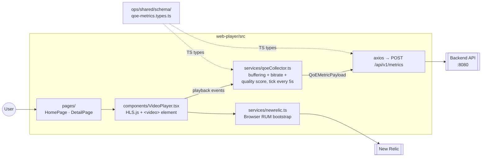

# Web Player

React / TypeScript HLS video player that collects QoE metrics and streams them to the backend API every 5 seconds.

## Tech stack

| Layer | Technology |
|---|---|
| UI | React 18, TypeScript |
| Video | HLS.js |
| Build | Vite |
| Unit tests | Vitest (jsdom) |
| E2E tests | Playwright (Chromium + throttle profiles) |
| Reports | Allure |
| Observability | New Relic Browser RUM |

## Module architecture

The player is intentionally simple: a `VideoPlayer` component wraps `<video>` and HLS.js, a `QoECollector` listens to playback events and ticks every 5s, and an axios-based service POSTs the payload to the backend. Types are imported directly from the canonical schema in `ops/shared/schema/qoe-metrics.types.ts` so the web client and the API stay in lockstep.



## Prerequisites

- Node.js 18+
- npm 9+
- Backend API running on port 8080 (see root [`docker-compose.yml`](../docker-compose.yml))

## Setup

```bash
cd web-player
npm install
```

A local `.env` (Vite reads `VITE_*` only):

```env
VITE_API_URL=http://localhost:8080/api/v1
```

> In Docker the API URL is injected at build time via the `VITE_API_URL` build arg.

## Running the app

```bash
npm run dev    # http://localhost:5173 (Vite dev server)
```

The Docker image is served by nginx on **http://localhost:3000** when the full stack is up (`docker compose up -d`).

## Tests

### Unit (Vitest)

```bash
npm test               # one-shot run, JUnit XML at test-results/vitest-junit.xml
npm run test:watch     # re-runs on file change
```

### E2E (Playwright)

```bash
npm run e2e:install        # install Chromium (first time only)
npm run e2e:bat            # @BAT suite (fast sanity, ~90s budget)
npm run e2e:smoke          # @Smoke suite

# Against the already-running Docker stack
npm run e2e:docker

# Interactive
npm run e2e:bat:headed     # visible browser
npm run e2e:debug          # Playwright inspector
npm run e2e:ui             # Playwright UI mode
```

#### E2E in Docker (no host install)

If you don't want `~150 MB` of Chromium and its system libs on your
laptop, run the suite inside the official Microsoft Playwright image
instead. The image already has Chromium / Firefox / WebKit baked in,
and `web-player/Dockerfile.e2e` pins the Playwright version to the one
in `package.json`.

```bash
# Bring up the app stack so the e2e container has something to hit
docker compose up -d backend web-player

# Run the BAT suite against http://web-player:3000 inside the network
docker compose --profile e2e run --rm e2e
```

Switch suites or override the grep without rebuilding the image:

```bash
PLAYWRIGHT_GREP=@Smoke   docker compose --profile e2e run --rm e2e
PLAYWRIGHT_GREP="Navbar" docker compose --profile e2e run --rm e2e
```

Reports are written to the host via bind-mounts:

| Path | What's inside |
|---|---|
| `web-player/playwright-report/` | Playwright HTML report — `npx playwright show-report` to open |
| `web-player/allure-results/` | Allure raw results — `allure serve web-player/allure-results` |
| `web-player/test-results/` | Per-test failure screenshots, videos, traces |

### Reports

```bash
npm run allure:report     # generate + open Allure
npm run allure:generate   # generate only
npm run allure:open       # open existing
npm run report            # Playwright HTML report
```

## Build

```bash
npm run build     # production bundle in dist/
```

## Project structure

```
web-player/
├── src/
│   ├── components/      # VideoPlayer, MetricsOverlay, …
│   ├── pages/           # HomePage, DetailPage
│   ├── services/        # qoeCollector, newrelic, api client
│   └── App.tsx, main.tsx
├── e2e/                 # Playwright specs (BAT + Smoke tagged)
├── playwright.config.ts # chromium + throttle profiles, workers=4
├── vite.config.ts
├── Dockerfile           # multi-stage: build → nginx
└── package.json
```

## Docker

```bash
docker build -t qoe-web-player -f web-player/Dockerfile .
# Or just bring up the full stack:
docker compose up -d
```

Served by nginx on **http://localhost:3000**.
